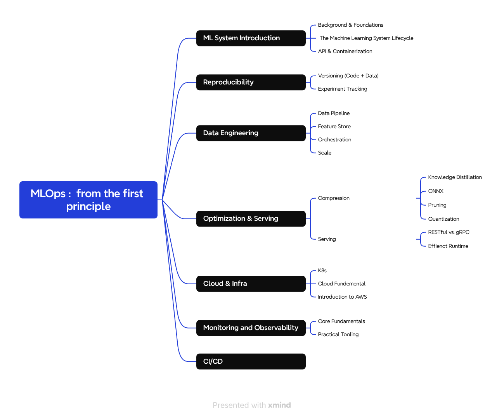

# MLOps from First Principles

<p align="center">
  
</p>

> *"The goal is not to teach you tools. It is to give you a mental model of the production ML system."*

A companion resource for the video lecture series.
Open this repo alongside the lectures — not instead of them.

---

## What This Repo Is

The lectures demonstrate. This repo explains.

Each module guide is structured as a lecture companion — the concepts, diagrams, and references you need while watching. The code is secondary: it is what the demo runs, not what the lecture is about.

**The goal is not to teach you tools. It is to give you a mental model of the production ML system and show how each tool solves a specific failure mode in that system.**

---

## The System We Are Building

```
┌─────────────────────────────────────────────────────────────┐
│                    DATA INGESTION                          │
│                    (Lesson 3.1)                            │
└────────────────────┬──────────────────────────────────────┘
                     ▼
┌─────────────────────────────────────────────────────────────┐
│                    FEATURE STORE                           │
│                    (Lesson 3.2)                            │
│  ┌──────────────┐           ┌──────────────┐              │
│  │   Offline    │──────────▶│    Online    │              │
│  │   (Train)    │           │   (Serve)    │              │
│  └──────────────┘           └──────────────┘              │
└────────────────────┬──────────────────────────────────────┘
          ┌──────────┴──────────┐
          ▼                     ▼
┌──────────────────┐  ┌──────────────────┐
│   TRAINING       │  │    SERVING       │
│   (Lessons 2.2-3)│  │    (Lesson 1.1)  │
│   MLflow / W&B   │  │    FastAPI       │
└────────┬─────────┘  └──────────────────┘
         ▼
┌─────────────────────────────────────────────────────────────┐
│              MODEL VERSIONING                              │
│              (Lesson 2.1)                                  │
│              DVC + Git                                     │
└────────────────────┬──────────────────────────────────────┘
                     ▼
┌─────────────────────────────────────────────────────────────┐
│              MODEL OPTIMIZATION                            │
│              (Lesson 4.1)                                  │
│   Prune → Quantize → KD → ONNX                            │
└────────────────────┬──────────────────────────────────────┘
                     ▼
┌─────────────────────────────────────────────────────────────┐
│              OPTIMIZED SERVING                             │
│              (Lesson 4.2)                                  │
│   TorchScript / LibTorch / gRPC                           │
└────────────────────┬──────────────────────────────────────┘
                     ▼
┌─────────────────────────────────────────────────────────────┐
│              PRODUCTION DEPLOYMENT                         │
│              (Lesson 5.1)                                  │
│   Kubernetes + AWS (EKS)                                  │
└────────────────────┬──────────────────────────────────────┘
                     ▼
┌─────────────────────────────────────────────────────────────┐
│              MONITORING + CI/CD                            │
│              (Lessons 5.2-3) [coming]                      │
│   Observability → Drift Detection → Auto-retrain          │
└─────────────────────────────────────────────────────────────┘

         Everything runs in Docker (Lesson 1.2)
         Orchestrated by Prefect + Spark (Lesson 3.3)
```

> 📍 **Full system diagram:** See [`SYSTEM_MAP.md`](SYSTEM_MAP.md)

---

## The Course Arc

Most ML courses teach tools in isolation: "here is MLflow, here is Docker." This course takes a different path: **start at the end, then fill in the gaps.**

```
MODULE 1 — The ML System
────────────────────────────────────────────────────────────
  Lesson 1.1   You have a model. How does anything call it?
               ↳ FastAPI wraps it. Docker makes it run anywhere.

  Lesson 1.2   Docker is foundational to every other component.
               How does it actually work?
               ↳ Containers, images, layer caching, Compose.

MODULE 2 — Reproducibility
────────────────────────────────────────────────────────────
  Lesson 2.1   Which version is in production?
               ↳ DVC: versions data + models alongside git.

  Lesson 2.2   You ran 20 experiments. Which was best?
               ↳ MLflow: structured logs, metric comparison.

  Lesson 2.3   Your team can't see each other's experiments.
               ↳ W&B: cloud-native tracking, artifact lineage.

MODULE 3 — Data Engineering for ML
────────────────────────────────────────────────────────────
  Lesson 3.1   What is in that data, and how is it built?
               ↳ ETL/ELT, validation, feature engineering.

  Lesson 3.2   Training and serving compute features differently.
               ↳ Feast: one definition for both.

  Lesson 3.3   How does it run every day, at scale?
               ↳ Prefect orchestrates. Spark distributes.

MODULE 4 — Model Optimization & Serving
────────────────────────────────────────────────────────────
  Lesson 4.1   The model is too large or too slow.
               ↳ Prune → Quantize → KD → ONNX.

  Lesson 4.2   Coupled to Python. Can't reach C++.
               ↳ TorchScript, LibTorch, gRPC.

MODULE 5 — Production Engineering
────────────────────────────────────────────────────────────
  Lesson 5.1   A single container is not production.
               ↳ Kubernetes, AWS (EKS), deployment strategies.

  Lesson 5.2   How do you know it still works?      [coming]
               ↳ Model drift, monitoring, alerting.

  Lesson 5.3   Every step above is manual.          [coming]
               ↳ CI/CD for ML: automated gates, GitOps.
```

---

## How to Use This Repo

| **When** | **What to do** |
|----------|----------------|
| **During the lecture** | Open the module guide and follow along. The guide provides the conceptual anchor for what the lecture is demonstrating. |
| **After the lecture** | Return to the deep-dive sections. The content goes further than the video to give you the full picture. |
| **For reference** | `SYSTEM_MAP.md` shows where every piece fits. Reconnects isolated concepts to the whole system. |

---

## Course Map

### Module 1 — The ML System
*Start at the end. Understand what you're building toward.*

| Lesson | Topic | Guide | Status |
|--------|-------|-------|--------|
| 1.1 | [Serving with FastAPI](Module_1_ML_Systems_Intro/Lesson_1_Serving_with_FastAPI/) | [FASTAPI_DOCKER_GUIDE.md](Module_1_ML_Systems_Intro/Lesson_1_Serving_with_FastAPI/FASTAPI_DOCKER_GUIDE.md) | ✓ |
| 1.2 | [Docker in Depth](Module_1_ML_Systems_Intro/Lesson_2_Docker_in_Depth/) | [docker_commands.md](Module_1_ML_Systems_Intro/Lesson_2_Docker_in_Depth/docker_commands.md) | ✓ |

### Module 2 — Reproducibility
*You can't improve what you can't reproduce.*

| Lesson | Topic | Guide | Status |
|--------|-------|-------|--------|
| 2.1 | [Data & Model Versioning — DVC](Module_2_Reproducibility/Lesson_1_Data_and_Model_Versioning/) | [DVC_GUIDE.md](Module_2_Reproducibility/Lesson_1_Data_and_Model_Versioning/DVC_GUIDE.md) | ✓ |
| 2.2 | [Experiment Tracking — MLflow](Module_2_Reproducibility/Lesson_2_Experiment_Tracking_MLflow/) | [README.md](Module_2_Reproducibility/Lesson_2_Experiment_Tracking_MLflow/README.md) | ✓ |
| 2.3 | [Experiment Tracking — W&B](Module_2_Reproducibility/Lesson_3_Experiment_Tracking_WandB/) | [WANDB_GUIDE.md](Module_2_Reproducibility/Lesson_3_Experiment_Tracking_WandB/WANDB_GUIDE.md) | ✓ |

### Module 3 — Data Engineering for ML
*The model is only as good as the data that reaches it.*

| Lesson | Topic | Guide | Status |
|--------|-------|-------|--------|
| 3.1 | [Data Pipelines](Module_3_Data_Engineering/Lesson_1_Data_Pipelines/) | [DATA_PIPELINE_GUIDE.md](Module_3_Data_Engineering/Lesson_1_Data_Pipelines/DATA_PIPELINE_GUIDE.md) | ✓ |
| 3.2 | [Feature Store — Feast](Module_3_Data_Engineering/Lesson_2_Feature_Store/) | [FEAST_GUIDE.md](Module_3_Data_Engineering/Lesson_2_Feature_Store/FEAST_GUIDE.md) | ✓ |
| 3.3 | [Orchestration + Scale](Module_3_Data_Engineering/Lesson_3_Orchestration_and_Scale/) | [DATA_PIPELINE_PART3_GUIDE.md](Module_3_Data_Engineering/Lesson_3_Orchestration_and_Scale/DATA_PIPELINE_PART3_GUIDE.md) | ✓ |

### Module 4 — Model Optimization & Serving
*The model that trains is rarely the model that deploys.*

| Lesson | Topic | Guide | Status |
|--------|-------|-------|--------|
| 4.1 | [Compression](Module_4_Model_Optimization_and_Serving/Lesson_1_Compression/) | [Overview](Module_4_Model_Optimization_and_Serving/Lesson_1_Compression/COMPRESSION_OVERVIEW.md) · [Pruning](Module_4_Model_Optimization_and_Serving/Lesson_1_Compression/pruning/PRUNING_GUIDE.md) · [Quantization](Module_4_Model_Optimization_and_Serving/Lesson_1_Compression/Quantization/QNT_GUIDE.md) · [KD](Module_4_Model_Optimization_and_Serving/Lesson_1_Compression/KD/KD_GUIDE.md) · [ONNX](Module_4_Model_Optimization_and_Serving/Lesson_1_Compression/onnx/ONNX_GUIDE.md) | ✓ |
| 4.2 | [Serving](Module_4_Model_Optimization_and_Serving/Lesson_2_Serving/) | [TorchScript](Module_4_Model_Optimization_and_Serving/Lesson_2_Serving/TorchScript/TORCHSCRIPT_GUIDE.md) · [LibTorch](Module_4_Model_Optimization_and_Serving/Lesson_2_Serving/LibTorch/LIBTORCH_GUIDE.md) · [gRPC](Module_4_Model_Optimization_and_Serving/Lesson_2_Serving/API_gRPC/GRPC_GUIDE.md) | ✓ |

### Module 5 — Production Engineering
*A deployed model is a system. Systems require infrastructure.*

| Lesson | Topic | Guide | Status |
|--------|-------|-------|--------|
| 5.1 | [Kubernetes & Cloud](Module_5_Production_Engineering/Lesson_1_K8s/) | [K8s.md](Module_5_Production_Engineering/Lesson_1_K8s/K8s.md) · [Cloud](Module_5_Production_Engineering/Lesson_2_Cloud_and_AWS/) | ✓ |
| 5.2 | Monitoring + Observability | — | 🚧 |
| 5.3 | CI/CD for ML | — | 📝 |

---

## Module Structure

Each module guide follows the same pattern:

```
┌─────────────────────────────────────────────────────────────────┐
│ The Problem        Why production ML needs this                │
├─────────────────────────────────────────────────────────────────┤
│ The Mental Model   One diagram or analogy that makes it stick  │
├─────────────────────────────────────────────────────────────────┤
│ How It Works       The mechanism, independent of the tool      │
├─────────────────────────────────────────────────────────────────┤
│ The Lecture        What the demo demonstrates and why          │
├─────────────────────────────────────────────────────────────────┤
│ Where It Fits      Connection to the full system               │
├─────────────────────────────────────────────────────────────────┤
│ Quick Reference    Commands and patterns to use                │
└─────────────────────────────────────────────────────────────────┘
```

> 💡 **Read the problem and mental model first.** The code is obvious after that.

---

## Prerequisites

```bash
# Core
Python 3.10+
uv (pip install uv)
Docker Desktop
Git

# Module 2
W&B account (free at wandb.ai)

# Module 5
kubectl
kind or minikube
awscli (for AWS deployment)
```

---

## Quick Navigation

| Area | Path |
|------|------|
| 📊 System Overview | [`SYSTEM_MAP.md`](SYSTEM_MAP.md) |
| 🚀 Module 1 — Serving | [`Module_1_ML_Systems_Intro/`](Module_1_ML_Systems_Intro/) |
| 📈 Module 2 — Reproducibility | [`Module_2_Reproducibility/`](Module_2_Reproducibility/) |
| 🗄️ Module 3 — Data Engineering | [`Module_3_Data_Engineering/`](Module_3_Data_Engineering/) |
| ⚡ Module 4 — Optimization | [`Module_4_Model_Optimization_and_Serving/`](Module_4_Model_Optimization_and_Serving/) |
| ☁️ Module 5 — Production | [`Module_5_Production_Engineering/`](Module_5_Production_Engineering/) |

---

## Technologies by Module

| Module | Technologies |
|--------|--------------|
| 1 | FastAPI, Docker, Docker Compose |
| 2 | Git, DVC, MLflow, Weights & Biases |
| 3 | Feast, Prefect, Spark, Pandas |
| 4 | Pruning, Quantization, KD, ONNX, TorchScript, LibTorch, gRPC |
| 5 | Kubernetes, AWS (EC2, S3, ECR, VPC, IAM, EKS) |

---

## Status Legend

| Icon | Meaning |
|------|---------|
| ✓ | Complete |
| 🚧 | In Progress |
| 📝 | Planned |

---

## Companion Resource

This repo is the written half of the course. The video lecture series is the visual, live demonstration half. Neither is complete without the other.

> **When the video moves fast:** slow down here.
> **When a guide feels abstract:** watch the demo.

---

## License

This project is for educational purposes. All content is provided as a companion resource to the video lecture series.
