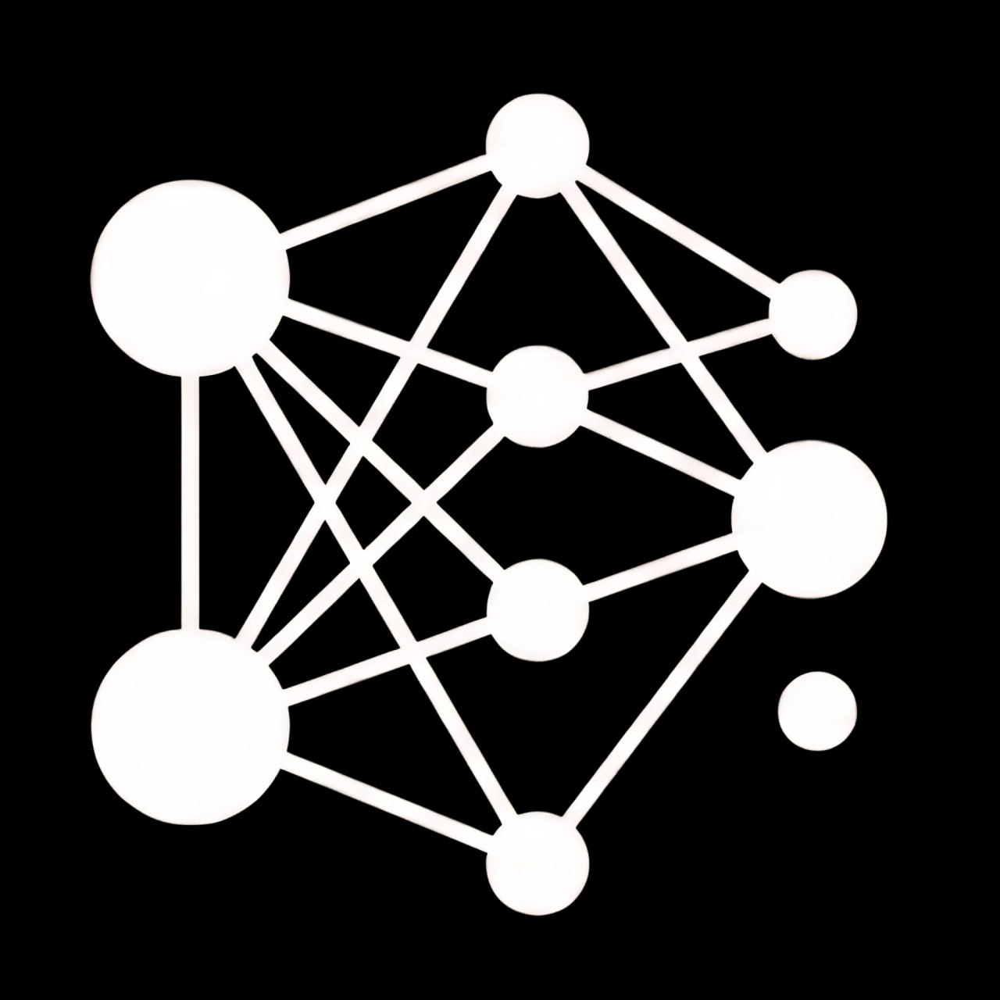

# ⚙️ SAiR MLOps Blueprint

<div align="center">



### **90% of ML Models Never Reach Production. This Module Shows You the Other 10%.**
*Module 6 of the SAIR Jr. Certification Track — Sudanese Artificial Intelligence Research (SAIR) Initiative*

<table>
<tr>
<td align="center">
<a href="https://t.me/sair19969">

</a>
</td>
<td align="center">
<a href="https://youtube.com/playlist?list=PLVM9Nqm8zLE0&si=jtIah3TJB8PjOMgu">

</a>
</td>
<td align="center">
<a href="https://github.com/SAIR-Org/SAIR_Jr">

</a>
</td>
</tr>
</table>

**Duration:** 6-8 weeks · **Prerequisite:** [SAIR Jr. Modules 0-5](https://github.com/SAIR-Org/SAIR_Jr) · **Format:** Theory playlist + live cohort builds

</div>

---

## 🎯 **The Problem This Module Solves**

You already know how to train a model. That was never the hard part.

The hard part is everything that happens after: the model that works perfectly on your laptop and silently degrades in production. The experiment you can't reproduce three weeks later. The "quick deploy" that becomes a 2am pager alert. The world shifts — a pandemic, a policy change, a new customer segment — and your model keeps confidently returning answers that are now wrong, and nothing tells you.

Most MLOps resources respond to this by teaching **tool syntax in isolation**: a 20-minute MLflow demo, a Docker "hello world," a FastAPI quickstart. You walk away able to name the tools. You still can't explain what breaks without them, and you've never felt what it's like when the ground shifts under a model you shipped.

**This module is built backwards from that failure.** Every tool is introduced as the answer to a problem you're already stuck in. You learn MLflow because Module 1 leaves you with 20 untracked experiments and no way to know which was best. You learn Docker because your model works on your machine and fails on your teammate's.

---

## 🔄 **Two Tracks, One System**

This module runs on two resources at once — not alternatives, two lenses on the same subject. One builds the **mental model**, the other builds the **muscle memory**.

```
📖 DDODS (MLOps from First Principles)          🏗️ SAIRCAMP (Live Cohort)
────────────────────────────────                  ────────────────────────────────
Solo-recorded YouTube playlist                     Live sessions, built with the cohort
Concept-first, broad coverage                      Project-first, production depth
Every major tool, explained in isolation           Tools layered onto ONE growing system
tied to the failure mode it solves                 module by module, week by week

"Why does this exist?"                             "How do I actually build it?"
────────────────────────────────                  ────────────────────────────────
        │                                                    │
        └─────────────────────┬──────────────────────────────┘
                               ▼
              Watch the concept → then build it live
           (no fixed 1:1 week mapping — First Principles
            is broader than any single SAIRCAMP project;
              use it as reference material throughout)
                               │
                               ▼
                ┌─────────────────────────────────┐
                │   Live HTTPS Endpoint            │
                │   https://your-domain.com        │
                │   ├── /        Dashboard          │
                │   ├── /api     Predictions        │
                │   ├── /batch   Batch scoring       │
                │   └── /mlflow  Experiment tracking │
                └─────────────────────────────────┘
```

| Track | Format | Philosophy | Repo | Status |
|---|---|---|---|---|
| 📖 DDODS — MLOps from First Principles | YouTube + standalone repo | Foundation first, tool second | [github.com/MaaS-YT/MLOps-from-the-first-principles](https://github.com/MaaS-YT/MLOps-from-the-first-principles) | ✅ Available |
| 🏗️ SAIRCAMP MLOps | Live cohort, standalone repo | Implementation heavy, one system, tool-first | [github.com/SAIR-Org/SAiRCAMP_1](https://github.com/SAIR-Org/SAiRCAMP_1) | ✅ Available |

> 📌 **Note:** `DDODS/` and `SAiRCAMP/` are **Git submodules** in this repo. They appear as folders here but link to their standalone repositories. Click the links above to visit them directly, or browse them locally in their respective folders.

**Take both.** Watch the theory around the same time you hit the matching build session — the video gives you the mental model before you're in the weeds wiring Docker networks together. They don't run on a synced week-by-week schedule; use *First Principles* as a standing reference throughout the whole module.

---

## 🗺️ **Quick Navigation — Clickable Links**

| Resource | Format | Standalone Repo | Local Path |
|---|---|---|---|
| 📖 DDODS — MLOps from First Principles | YouTube + standalone repo | [github.com/MaaS-YT/MLOps-from-the-first-principles](https://github.com/MaaS-YT/MLOps-from-the-first-principles) | [`./DDODS/`](./DDODS/) |
| 🏗️ SAIRCAMP MLOps | Live cohort, standalone repo | [github.com/SAIR-Org/SAiRCAMP_1](https://github.com/SAIR-Org/SAiRCAMP_1) | [`./SAiRCAMP/`](./SAiRCAMP/) |

---

## 🏗️ **SAIRCAMP Is a Series, Not a Single System**

SAIRCAMP is a track of complete, real, end-to-end builds — each one a full production system on its own, each teaching MLOps against a different kind of model, released live to the cohort one at a time.

<div align="center">

<table>
<thead>
<tr>
<th width="8%">#</th>
<th width="27%">Project</th>
<th width="35%">What It's Built Around</th>
<th width="15%">Status</th>
<th width="15%">Repo</th>
</tr>
</thead>
<tbody>
<tr>
<td align="center"><strong>1</strong><br/>🚕</td>
<td><strong>SAIRCAMP MLOps</strong></td>
<td>NYC Taxi trip duration prediction — classical ML, tabular data, 8 modules from notebook to secured production system</td>
<td align="center">✅ Built</td>
<td align="center"><a href="https://github.com/SAIR-Org/SAiRCAMP_1">🔗 Link</a></td>
</tr>
<tr>
<td align="center"><strong>2</strong><br/>🧠</td>
<td><strong>SAIRCAMP DL</strong></td>
<td>Deep learning system — full scope TBA</td>
<td align="center">✅ Built</td>
<td align="center">🔜 to be announced</td>
</tr>
<tr>
<td align="center"><strong>3</strong><br/>📄</td>
<td><strong>SAIRCAMP DocIntel</strong></td>
<td>Document Intelligence platform for digital transformation — scope TBA</td>
<td align="center">📝 Planned</td>
<td align="center">🔜 coming</td>
</tr>
</tbody>
</table>

</div>

> Repos go live as each project is revealed to the cohort. This table updates with real links as that happens — follow [Telegram](https://t.me/sair19969) for announcements.

Each project is a **complete arc on its own** — same MLOps principles, applied to a different problem shape, so the concepts generalize instead of feeling tied to one dataset.

---

## 🚕 **A Closer Look — Project 1: SAIRCAMP MLOps**

**The arc:** notebook → tracked → structured → orchestrated → served online → served offline + monitored → integrated system → real VPS → secured + auto-deploying

### 8 Modules, 8 Failure Modes Eliminated

| Module | Problem | What You Build | Tool |
|---|---|---|---|
| 1 | Naive model, hidden data leakage | EDA, sklearn pipelines, a model you can trust | sklearn |
| 2 | Untracked experiments | MLflow tracking + model registry | MLflow |
| 3 | Unreproducible, unstructured pipelines | Clean code, retries, `@task`/`@flow` orchestration | Prefect |
| 4 | Model that only runs in a notebook | Online serving API | FastAPI + Docker |
| 5 | Silent degradation, no visibility | Batch scoring + drift detection dashboard | Streamlit |
| 6 | Services that don't talk to each other | Full integrated local system | Docker Compose |
| 7 | "Works on my machine" | Running on a real VPS | SSH, firewall, remote MLflow |
| 8 | Insecure, manual, no auto-deploy | HTTPS + CI/CD | Nginx, Certbot, GitHub Actions |

<details>
<summary><b>📋 Full module breakdown</b></summary>

| Module | What's Built | Key Concepts |
|---|---|---|
| 1 | Naive → broken → fixed model | EDA, data leakage, sklearn pipelines |
| 2 | Experiment tracking + registry | MLflow runs, aliases, comparison |
| 3 | Structured + orchestrated pipeline | Clean code, retries, Prefect `@task`/`@flow` |
| 4 | Online serving | FastAPI, Docker, MLflow aliases |
| 5 | Batch scoring + drift monitoring | Async API, MAE ratio, Streamlit |
| 6 | Full integrated local system | Docker Compose, service networking |
| 7 | Running on a real VPS | SSH, firewall, remote MLflow, SSH tunnel |
| 8 | Production hardening | Nginx, DuckDNS, SSL/Certbot, GitHub Actions CI/CD |

</details>

### **The Moment This Module Earns Its Keep**

You train the model on 2019 taxi trips. You deploy it. Then you batch-score it forward through time, month by month — and in April 2020, its error rate more than doubles without a single line of code changing.

You don't need COVID explained to you. You lived it. That's the point: **this isn't a synthetic drift demo, it's a real system meeting a real discontinuity in the world**, and monitoring is the only reason anyone would have caught it before it cost something. Most students never *feel* why monitoring matters until it's too late on a real job. Here, you feel it in week 5.

Full module-by-module breakdown will live in that project's own README once its repo is public.

---

## 🛠️ **Technology Stack You'll Master**

<div align="center">

<table>
<tr>
<td align="center" width="20%">
<div style="background: #f3e5f5; padding: 15px; border-radius: 10px;">
<h4>🎯 Tracking</h4>
<code style="background: #f8f9fa; padding: 2px 6px; border-radius: 4px; display: block; margin: 5px 0;">📈 MLflow</code>
<code style="background: #f8f9fa; padding: 2px 6px; border-radius: 4px; display: block; margin: 5px 0;">🗂️ Model Registry</code>
</div>
</td>
<td align="center" width="20%">
<div style="background: #e3f2fd; padding: 15px; border-radius: 10px;">
<h4>🔄 Orchestration</h4>
<code style="background: #f8f9fa; padding: 2px 6px; border-radius: 4px; display: block; margin: 5px 0;">⚡ Prefect</code>
<code style="background: #f8f9fa; padding: 2px 6px; border-radius: 4px; display: block; margin: 5px 0;">🔁 Retries</code>
</div>
</td>
<td align="center" width="20%">
<div style="background: #fff3e0; padding: 15px; border-radius: 10px;">
<h4>🚀 Serving</h4>
<code style="background: #f8f9fa; padding: 2px 6px; border-radius: 4px; display: block; margin: 5px 0;">⚡ FastAPI</code>
<code style="background: #f8f9fa; padding: 2px 6px; border-radius: 4px; display: block; margin: 5px 0;">🐳 Docker</code>
</div>
</td>
<td align="center" width="20%">
<div style="background: #e8f5e9; padding: 15px; border-radius: 10px;">
<h4>📊 Monitoring</h4>
<code style="background: #f8f9fa; padding: 2px 6px; border-radius: 4px; display: block; margin: 5px 0;">🌊 Streamlit</code>
<code style="background: #f8f9fa; padding: 2px 6px; border-radius: 4px; display: block; margin: 5px 0;">📉 Drift Detection</code>
</div>
</td>
<td align="center" width="20%">
<div style="background: #fce4ec; padding: 15px; border-radius: 10px;">
<h4>☁️ Production</h4>
<code style="background: #f8f9fa; padding: 2px 6px; border-radius: 4px; display: block; margin: 5px 0;">🌐 Nginx</code>
<code style="background: #f8f9fa; padding: 2px 6px; border-radius: 4px; display: block; margin: 5px 0;">🔧 GitHub Actions</code>
</div>
</td>
</tr>
</table>

</div>

Each tool above is taught through the failure it solves, not as an isolated technology.

---

## 💼 **What You Walk Away Able to Do**

This is the difference between *"I've heard of Docker"* and being someone a hiring manager trusts with production systems on day one:

- **Debug a model that's silently degrading in production** — not just retrain it and hope, but diagnose *why* with drift metrics
- **Explain the tradeoffs of every tool you touch** — not recite what MLflow does, but say what breaks without it
- **Own a deployment end to end** — from `git push` to a live HTTPS endpoint with CI/CD, with no one holding your hand
- **Speak the language of an ML platform team in an interview** — because you've actually run the pager, not just read about it

We're not going to hand you invented statistics about job placement — this track is new, and we'd rather you trust real evidence than a marketing number. What we can promise is this: the gap between "trained a model in a notebook" and "operates a production ML system" is exactly the gap most junior candidates get filtered out on. This module closes it.

---

## 🎓 **Module 6 Completion Requirements**

<table>
<tr>
<td width="50%" valign="top">

**📚 Technical Excellence**
- ✅ Watch the full *MLOps from First Principles* playlist
- ✅ Complete SAIRCAMP Project 1 (Classical ML) end to end
- ✅ Reproduce the production deploy: Docker Compose → VPS → nginx + HTTPS + CI/CD
- ✅ Explain, for every tool used, what failure mode it exists to solve

</td>
<td width="50%" valign="top">

**🤝 Community & Professional Standards**
- ✅ Active participation in the live cohort sessions
- ✅ Present your deployed system with a live demo
- ✅ Push at least one real `git push origin main` that triggers CI/CD
- ✅ Help a peer debug their VPS or Docker setup

</td>
</tr>
</table>

---

## 🚀 **Getting Started**

<div align="center">

<table>
<tr>
<td width="33%" align="center">
<h4><code>👥</code> 1️⃣ Join the Cohort</h4>
<a href="https://t.me/sair19969">Telegram: t.me/sair19969</a>
</td>
<td width="33%" align="center">
<h4><code>📖</code> 2️⃣ Start the Theory Track</h4>
<a href="https://github.com/MaaS-YT/MLOps-from-the-first-principles">DDODS — MLOps from First Principles</a>
</td>
<td width="34%" align="center">
<h4><code>🏗️</code> 3️⃣ Build the System</h4>
<a href="https://github.com/SAIR-Org/SAiRCAMP_1">SAIRCAMP MLOps — End to End</a>
</td>
</tr>
</table>

</div>

```bash
# Clone the hub repo (this one)
git clone https://github.com/SAIR-Org/SAiR-MLOps-Blueprint.git
cd SAiR-MLOps-Blueprint

# Initialize and update submodules (DDODS + SAiRCAMP)
git submodule update --init --recursive

# Now you have both tracks locally:
#   ./DDODS/     → MLOps from First Principles (theory)
#   ./SAiRCAMP/  → SAIRCAMP MLOps (end-to-end implementation)

# To update submodules to their latest versions:
git submodule update --remote
```

---

## 📚 **Where This Fits in SAIR Jr.**

```
Module 4 — Applied Deep Learning     ✅   github.com/SAIR-Org/SAIR_Jr
Module 5 — GPT from Scratch          ✅   github.com/SAIR-Org/SAIR_Jr
Module 6 — MLOps  ← you are here          github.com/SAIR-Org/SAiR-MLOps-Blueprint
  ├── DDODS                         (theory, standalone repo)
  └── SAIRCAMP                      (live builds, standalone repo)
Capstone — Real-World Impact Project      github.com/SAIR-Org/SAIR_Jr
```

Module 6 is where everything from Modules 0-5 stops being *"a model in a notebook"* and becomes something a team could actually run. Head back to [SAIR_Jr](https://github.com/SAIR-Org/SAIR_Jr) for the rest of the track and the capstone.

---

<div align="center">

**License:** MIT | **Status:** ✅ Available

[SAIR Initiative](https://github.com/SAIR-Org) · [Telegram](https://t.me/sair19969) · [YouTube](https://youtube.com/playlist?list=PLVM9Nqm8zLE0&si=jtIah3TJB8PjOMgu)

**Building Sudan's AI Future, One Production System at a Time 🇸🇩✨**

</div>
